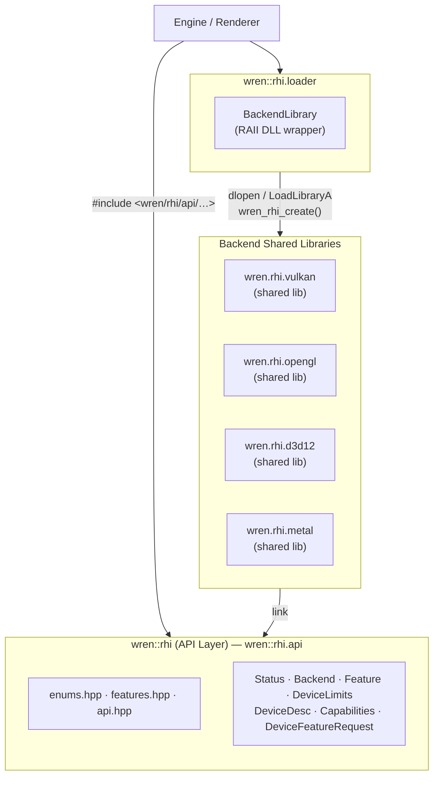

# RHI — Architecture

The Render Hardware Interface (RHI) is a thin, data-oriented abstraction that insulates
the rest of the engine from graphics-API specifics. It presents one vocabulary of objects
and commands; backend plug-ins translate those into Vulkan, OpenGL 4.x, Direct3D 12, or
Metal calls at runtime.

______________________________________________________________________

## Table of Contents

1. [Goals & Non-goals](#1-goals--non-goals)
1. [Prior Art & Inspiration](#2-prior-art--inspiration)
1. [Layer Structure](#3-layer-structure)
1. [API Layer — Core Abstractions](#4-api-layer--core-abstractions)
   - 4.1 [Status](#41-status)
   - 4.2 [Backend Enum](#42-backend-enum)
   - 4.3 [Features & Limits](#43-features--limits)
   - 4.4 [Device Creation](#44-device-creation)
   - 4.5 [Queue Model](#45-queue-model)
   - 4.6 [Resources](#46-resources)
   - 4.7 [Pipeline State Objects](#47-pipeline-state-objects)
   - 4.8 [Command Recording & Submission](#48-command-recording--submission)
   - 4.9 [Synchronization](#49-synchronization)
   - 4.10 [Shader Stages](#410-shader-stages)
   - 4.11 [Render Passes & Dynamic Rendering](#411-render-passes--dynamic-rendering)
   - 4.12 [Swap Chain & Presentation](#412-swap-chain--presentation)
1. [Primitive Catalogue](#5-primitive-catalogue)
   - 5.1 [Formats](#51-formats)
   - 5.2 [Vertex & Index Streams](#52-vertex--index-streams)
   - 5.3 [Rasterizer State](#53-rasterizer-state)
   - 5.4 [Depth / Stencil State](#54-depth--stencil-state)
   - 5.5 [Blend State](#55-blend-state)
   - 5.6 [Sampler State](#56-sampler-state)
1. [Backend Implementations](#6-backend-implementations)
   - 6.1 [Vulkan](#61-vulkan)
   - 6.2 [OpenGL](#62-opengl)
   - 6.3 [Direct3D 12](#63-direct3d-12)
   - 6.4 [Metal](#64-metal)
1. [Feature Negotiation](#7-feature-negotiation)
1. [Memory Model](#8-memory-model)
1. [Debug & Tooling](#9-debug--tooling)
1. [Design Trade-offs & Future Work](#10-design-trade-offs--future-work)

______________________________________________________________________

## 1. Goals & Non-goals

### Goals

| Goal                                      | Rationale                                                                                                                        |
| ----------------------------------------- | -------------------------------------------------------------------------------------------------------------------------------- |
| **Single vocabulary**                     | Callers write to one API; the backend is a runtime choice.                                                                       |
| **Explicit over implicit**                | Resources carry explicit usage flags; barriers are explicit. No hidden GPU stalls.                                               |
| **Feature negotiation at creation time**  | Required vs. preferred features are resolved once. The hot path never queries capabilities.                                      |
| **Minimal allocation overhead**           | Descriptors are plain aggregates (`struct`, no heap). Resources are opaque handles.                                              |
| **Cross-API correctness by construction** | Enumerations are the intersection across Vulkan, GL 4.x, D3D12, and Metal (with per-API notes in every `enum class` definition). |

### Non-goals

- **Scene graph / draw call sorting** — that is the renderer's responsibility.
- **Shader compilation** — SPIR-V cross-compilation, HLSL, or MSL authoring is handled upstream.
- **Window/OS management** — window handles are passed in from the platform layer (`wren::platform`); the RHI does not own them.
- **Memory pooling** — backends may implement pools internally, but no custom allocator interface is exposed yet.

______________________________________________________________________

## 2. Prior Art & Inspiration

The design draws heavily from several well-studied sources:

| Project / Paper                                                                                                   | Relevance                                                                                                                                                                         |
| ----------------------------------------------------------------------------------------------------------------- | --------------------------------------------------------------------------------------------------------------------------------------------------------------------------------- |
| [**Unreal Engine RHI**](https://docs.unrealengine.com/5.3/en-US/graphics-programming-overview-for-unreal-engine/) | Canonical example of engine-level graphics abstraction; command list model and platform-specific back-ends.                                                                       |
| [**DiligentEngine**](https://github.com/DiligentGraphics/DiligentEngine)                                          | Open-source, closely mirrors D3D11/D3D12 concepts; excellent cross-API mapping reference. The `IShaderResourceVariable` binding model informed our feature-negotiation decisions. |
| [**bgfx**](https://github.com/bkaradzic/bgfx)                                                                     | Lightweight, header-only API surface. Informed the "small plain structs as descriptors" pattern.                                                                                  |
| [**The-Forge**](https://github.com/ConfettiFX/The-Forge)                                                          | Modern multi-API renderer with a strong feature-flag model, mesh shader support, and bindless heaps.                                                                              |
| [**wgpu / WebGPU spec**](https://www.w3.org/TR/webgpu/)                                                           | The WebGPU API is the most carefully cross-API designed surface available; device-limits, feature queries, and error model all influenced this RHI.                               |
| [**sokol_gfx**](https://github.com/floooh/sokol)                                                                  | Minimalist C API; demonstrates how a tiny API surface can cover GL/Metal/Vulkan/D3D11.                                                                                            |
| [**Filament**](https://github.com/google/filament)                                                                | Google's production renderer; its backend abstraction layer and `DriverAPI` pattern informed descriptor design.                                                                   |
| [**GfxSamples (AMD)**](https://github.com/GPUOpen-LibrariesAndSDKs/GpuOpenOpenCLSamples)                          | Low-level Vulkan/DX12 barrier patterns directly referenced in the resource usage design.                                                                                          |
| Wihlidal — *"Optimizing the Graphics Pipeline with Compute"* (GDC 2016)                                           | Async compute queue design and explicit barrier rationale. [Slides](https://www.gdcvault.com/play/1023109/Optimizing-the-Graphics-Pipeline-With)                                  |
| Barré-Brisebois — *"Rendering the Hellscape of DOOM Eternal"* (GDC 2021)                                          | Resource state tracking and synchronization model in a multi-queue renderer.                                                                                                      |
| Khronos — *Vulkan 1.4 Core Specification*                                                                         | Authoritative reference for all Vulkan enum values, synchronization stages, and feature bits. [HTML](https://registry.khronos.org/vulkan/specs/latest/html/)                      |
| Microsoft — *Direct3D 12 Programming Guide*                                                                       | D3D12 resource states, descriptor heap tiers, and resource binding reference. [Docs](https://learn.microsoft.com/windows/win32/direct3d12/directx-12-programming-guide)           |
| Apple — *Metal Shading Language Specification*                                                                    | Metal buffer/texture abstraction and argument buffer model. [PDF](https://developer.apple.com/metal/Metal-Shading-Language-Specification.pdf)                                     |

______________________________________________________________________

## 3. Layer Structure



Build targets follow the naming `wren.rhi.<backend>` (alias `wren::rhi.<backend>`).
The API layer is a header-only/static target (`wren::rhi.api`) that every backend links
against. Backends are always built as **shared libraries** so they can be swapped at runtime
without relinking the engine.

Each backend exposes a single entry-point following the pattern established in
`projects/libs/rhi/backends/<backend>/include/` so the engine can load it via a factory
function without a hard compile-time dependency.

______________________________________________________________________

## 4. API Layer — Core Abstractions

All types live in `namespace wren::rhi`.

### 4.1 Status

```
wren/rhi/api/api.hpp
wren/rhi/api/status.hpp  (standalone copy used by backends)
```

```cpp
enum class Status : uint8_t { Ok, MissingRequiredFeature, UnsupportedFormat,
                              UnsupportedSampleCount, UnsupportedQueueType,
                              UnsupportedLimit, OutOfMemory, InvalidArgument,
                              InternalError };
```

Factories return `Status` directly. `to_string(Status)` is provided for
human-readable diagnostics.

**Contract:**

- Factories never return `Status::Ok` with a half-valid device.
- The hot-path (recording, dispatch) does **not** return `Status`; it uses
  `assert`-style contracts in debug builds only.

______________________________________________________________________

### 4.2 Backend Enum

```cpp
enum class Backend : uint8_t { OpenGL, Vulkan, D3D12, Metal, None };
```

Used in `Capabilities::backend` so a device can report which API it wraps.
The `None` sentinel is useful for null/stub devices in tests.

______________________________________________________________________

### 4.3 Features & Limits

```
wren/rhi/api/features.hpp
```

#### Feature flags — `enum class Feature : uint64_t`

A 64-bit capability bitmask populated by the backend at device creation.
Each bit documents its cross-API mapping:

| Bit  | Feature                       | Key API references                                                                                                                                                                                                                                                                                                                                                                                                                                                           |
| ---- | ----------------------------- | ---------------------------------------------------------------------------------------------------------------------------------------------------------------------------------------------------------------------------------------------------------------------------------------------------------------------------------------------------------------------------------------------------------------------------------------------------------------------------- |
| `0`  | `Tessellation`                | [`VkPhysicalDeviceFeatures::tessellationShader`](https://docs.vulkan.org/spec/latest/chapters/tessellation.html) · GL 4.0 core / ARB_tessellation_shader · D3D12 HS/DS · Metal 2+                                                                                                                                                                                                                                                                                            |
| `1`  | `GeometryShader`              | [`VkPhysicalDeviceFeatures::geometryShader`](https://docs.vulkan.org/spec/latest/chapters/geometry.html) · GL 3.2 · D3D12 GS · **Metal: no geometry shader (use compute/mesh)**                                                                                                                                                                                                                                                                                              |
| `2`  | `MeshShader`                  | [VK_EXT_mesh_shader](https://www.khronos.org/blog/mesh-shading-for-vulkan) · GL NV/EXT_mesh_shader · [D3D12 Mesh/Amplification SM6.5](https://learn.microsoft.com/windows/win32/api/d3d12/ne-d3d12-d3d12_shader_visibility) · Metal 3+                                                                                                                                                                                                                                       |
| `3`  | `RayTracing`                  | [VK_KHR_ray_tracing_pipeline](https://docs.vulkan.org/refpages/latest/refpages/source/VK_KHR_ray_tracing_pipeline.html) · [DXR 1.1](https://learn.microsoft.com/windows/win32/direct3d12/directx-raytracing) · Metal 3                                                                                                                                                                                                                                                       |
| `4`  | `TimelineSemaphore`           | [VK_KHR_timeline_semaphore](https://docs.vulkan.org/refpages/latest/refpages/source/VK_KHR_timeline_semaphore.html) (core 1.2) · [ID3D12Fence](https://learn.microsoft.com/windows/win32/api/d3d12/nn-d3d12-id3d12fence) · [MTLSharedEvent](https://developer.apple.com/documentation/metal/mtlsharedevent)                                                                                                                                                                  |
| `5`  | `DescriptorIndexing_Bindless` | [VK_EXT_descriptor_indexing](https://registry.khronos.org/vulkan/specs/latest/man/html/VK_EXT_descriptor_indexing.html) · [D3D12 Resource Binding Tiers](https://microsoft.github.io/DirectX-Specs/d3d/ResourceBinding.html) · [Metal Argument Buffers](https://developer.apple.com/documentation/metal/improving-cpu-performance-by-using-argument-buffers)                                                                                                                 |
| `6`  | `DescriptorBuffer`            | [VK_EXT_descriptor_buffer](https://registry.khronos.org/vulkan/specs/latest/man/html/VK_EXT_descriptor_buffer.html)                                                                                                                                                                                                                                                                                                                                                          |
| `7`  | `BufferDeviceAddress`         | [VK_KHR_buffer_device_address](https://registry.khronos.org/vulkan/specs/latest/man/html/VK_KHR_buffer_device_address.html)                                                                                                                                                                                                                                                                                                                                                  |
| `8`  | `MultiDrawIndirect`           | [vkCmdDrawIndirectCount](https://registry.khronos.org/vulkan/specs/latest/man/html/vkCmdDrawIndirectCount.html) · [ARB_multi_draw_indirect](https://registry.khronos.org/OpenGL/extensions/ARB/ARB_multi_draw_indirect.txt) · [D3D12 ExecuteIndirect](https://learn.microsoft.com/windows/win32/direct3d12/executeindirect) · [Metal ICBs](https://developer.apple.com/documentation/metal/accelerating_draw_calls_with_indirect_command_buffers)                            |
| `9`  | `Subgroup_WaveOps`            | Vulkan subgroup ops (core 1.1) · [HLSL Wave intrinsics SM6](https://learn.microsoft.com/windows/win32/direct3dhlsl/hlsl-shader-model-6-0-features-for-direct3d-12) · MSL SIMD-group                                                                                                                                                                                                                                                                                          |
| `12` | `ImageLoadStore_UAV`          | [ARB_shader_image_load_store](https://registry.khronos.org/OpenGL/extensions/ARB/ARB_shader_image_load_store.txt) · D3D12 UAVs                                                                                                                                                                                                                                                                                                                                               |
| `13` | `VariableRateShading`         | [VK_KHR_fragment_shading_rate](https://docs.vulkan.org/samples/latest/samples/extensions/fragment_shading_rate_dynamic/README.html) · [D3D12 VRS](https://learn.microsoft.com/windows/win32/direct3d12/vrs) · [Metal Rasterization Rate Maps](https://developer.apple.com/documentation/metal/rasterization_rate_maps)                                                                                                                                                       |
| `15` | `FragmentInterlock_ROV`       | [VK_EXT_fragment_shader_interlock](https://docs.vulkan.org/refpages/latest/refpages/source/VK_EXT_fragment_shader_interlock.html) · [ARB_fragment_shader_interlock](https://registry.khronos.org/OpenGL/extensions/ARB/ARB_fragment_shader_interlock.txt) · [D3D12 ROVs](https://learn.microsoft.com/windows/win32/direct3d12/rasterizer-order-views) · [Metal Raster Order Groups](https://developer.apple.com/documentation/metal/mtldevice/arerasterordergroupssupported) |
| `26` | `DynamicRendering`            | [VK_KHR_dynamic_rendering](https://registry.khronos.org/vulkan/specs/latest/man/html/VK_KHR_dynamic_rendering.html) (core 1.3)                                                                                                                                                                                                                                                                                                                                               |

Bits `28–30` cover texture compression families (BC, ETC2, ASTC_LDR) which are queried
per-format on device creation. See `features.hpp` for the full enumeration.

Utilities `has_all(set, bits)` / `has_any(set, bits)` are provided as `constexpr` helpers.

#### Device Limits — `struct DeviceLimits`

Numeric hardware limits queried once at device creation and stored as plain-old-data:

```cpp
struct DeviceLimits {
    uint32_t maxImageDimension2D;        // GL_MAX_TEXTURE_SIZE / VkPhysicalDeviceLimits
    uint32_t maxColorAttachments;        // GL_MAX_COLOR_ATTACHMENTS / D3D12 8 fixed
    uint32_t maxVertexInputAttributes;
    uint32_t uniformBufferAlignment;     // 256B conservative across all APIs
    uint32_t maxComputeWorkGroupInvocations;
    uint64_t timelineTickFrequency;
    // … full list in features.hpp
};
```

References:

- Vulkan: [`VkPhysicalDeviceLimits`](https://registry.khronos.org/vulkan/specs/latest/man/html/VkPhysicalDeviceLimits.html)
- D3D12: [`D3D12_FEATURE_DATA_D3D12_OPTIONS`](https://learn.microsoft.com/windows/win32/api/d3d12/ns-d3d12-d3d12_feature_data_d3d12_options) family
- Metal: [Metal Feature Set Tables](https://developer.apple.com/documentation/metal/gpufamilies)
- OpenGL: `glGetIntegerv(GL_MAX_*)` queries

______________________________________________________________________

### 4.4 Device Creation

```cpp
struct DeviceDesc {
    void*      nativeWindowHandle    = nullptr;   // HWND/NSView/GLFWwindow/etc.
    uint32_t   preferredAdapterIndex = 0;
    DeviceFlag flags                 = DeviceFlag::None;  // Debug | Headless | HighPriority
    DeviceFeatureRequest featureRequest{};
};
```

The backend:

1. Enumerates physical adapters/devices.
1. Probes capability bits and fills `Capabilities`.
1. Evaluates `featureRequest.required` — returns `MissingRequiredFeature` if any bit is absent.
1. Enables as many `featureRequest.preferred` bits as possible, logging any that were downgraded.
1. Returns the initialised device handle plus the final `Capabilities` snapshot.

This two-phase negotiation (required / preferred) mirrors the pattern in
[WebGPU §device descriptor](https://www.w3.org/TR/webgpu/#dictdef-gpudevicedescriptor) and
[DiligentEngine's EngineCreateInfo](https://github.com/DiligentGraphics/DiligentCore/blob/master/Graphics/GraphicsEngine/interface/EngineFactory.h).

______________________________________________________________________

### 4.5 Queue Model

```cpp
enum class QueueType : uint8_t { Graphics, Compute, Transfer, Present };
```

| `QueueType` | Vulkan                         | D3D12                      | Metal                   | OpenGL                           |
| ----------- | ------------------------------ | -------------------------- | ----------------------- | -------------------------------- |
| `Graphics`  | `VK_QUEUE_GRAPHICS_BIT` family | `DIRECT` list              | Render command encoder  | Draw calls (serialised)          |
| `Compute`   | `VK_QUEUE_COMPUTE_BIT` family  | `COMPUTE` list             | Compute command encoder | Compute dispatch (GL 4.3+)       |
| `Transfer`  | `VK_QUEUE_TRANSFER_BIT` family | `COPY` list                | Blit command encoder    | `glCopyBufferSubData` etc.       |
| `Present`   | presentation-capable family    | `DIRECT` queue + swapchain | CAMetalLayer drawable   | `SwapBuffers` / `eglSwapBuffers` |

For OpenGL, all queue types collapse to the single implicit serialised context; the
`QueueType` enum is still useful for tracking which *kind* of work a command list contains.

**Async compute** — dedicated `Compute` queues enable async-compute patterns described in
Wihlidal's
[*"Optimizing the Graphics Pipeline with Compute"*](https://www.gdcvault.com/play/1023109/Optimizing-the-Graphics-Pipeline-With)
(GDC 2016). Whether a separate async compute queue is available is hardware-dependent; the
backend degrades to main-queue compute if not.

______________________________________________________________________

### 4.6 Resources

Resources are the GPU-side objects the RHI manages. They are identified by opaque handles
(type-safe integer IDs or typed pointers, depending on final implementation). Resources are
always allocated via descriptor structs:

#### Textures

Creation parameters combine:

- `TextureDimension` — `Tex1D / Tex2D / Tex3D / Cube`
- `TextureFormat` (see [§5.1](#51-formats))
- `TextureUsage` — bitmask: `Sampled | Storage | ColorAttachment | DepthStencilAtt | TransferSrc | TransferDst`
- `SampleCount` — `C1 / C2 / C4 / C8 / C16 / C32`
- Width, height, depth, mip levels, array layers

Equivalent concepts by backend:

|        | Vulkan                                                                                                      | D3D12                                                                                                       | Metal                                                                                | OpenGL                       |
| ------ | ----------------------------------------------------------------------------------------------------------- | ----------------------------------------------------------------------------------------------------------- | ------------------------------------------------------------------------------------ | ---------------------------- |
| Object | `VkImage`                                                                                                   | `ID3D12Resource`                                                                                            | `MTLTexture`                                                                         | texture name (`GLuint`)      |
| Usage  | [`VkImageUsageFlagBits`](https://docs.vulkan.org/refpages/latest/refpages/source/VkImageUsageFlagBits.html) | [`D3D12_RESOURCE_FLAGS`](https://learn.microsoft.com/windows/win32/api/d3d12/ne-d3d12-d3d12_resource_flags) | [`MTLTextureUsage`](https://developer.apple.com/documentation/metal/mtltextureusage) | implicit at bind site        |
| View   | `VkImageView`                                                                                               | `D3D12_CPU_DESCRIPTOR_HANDLE` (SRV/RTV/DSV/UAV)                                                             | view/texture type                                                                    | `glTextureView` / parameters |

#### Buffers

`BufferUsage` flags: `Vertex | Index | Uniform | Storage | Indirect | TransferSrc | TransferDst`

Equivalent concepts:

|        | Vulkan                                                                                                        | D3D12                  | Metal       | OpenGL                 |
| ------ | ------------------------------------------------------------------------------------------------------------- | ---------------------- | ----------- | ---------------------- |
| Object | `VkBuffer`                                                                                                    | `ID3D12Resource`       | `MTLBuffer` | buffer name (`GLuint`) |
| Usage  | [`VkBufferUsageFlagBits`](https://docs.vulkan.org/refpages/latest/refpages/source/VkBufferUsageFlagBits.html) | implicit via view type | implicit    | target at bind time    |

______________________________________________________________________

### 4.7 Pipeline State Objects

A _Pipeline State Object_ (PSO) bundles all immutable pipeline configuration into a single
object that can be validated and compiled once in the background. This follows the approach
standardised by APIs that learned from the OpenGL driver-mutation problems (see
[AMD's OpenGL best practices](https://gpuopen.com/performance/) for stall details).

A graphics PSO descriptor includes:

```
GraphicsPipelineDesc
├── ShaderStage shaders[]               // compiled shader modules per stage
├── PrimitiveTopology topology
├── VertexInputLayout                   // VertexFormat per attribute + binding stride
├── RasterizerStateDesc
│   ├── CullMode, FrontFace
│   ├── FillMode (solid / wireframe — Feature::NonSolidFill)
│   ├── DepthBias, SlopeScaledDepthBias
│   └── SampleCount (MSAA)
├── DepthStencilStateDesc
│   ├── bool depthTestEnable, depthWriteEnable
│   ├── CompareOp depthCompareOp
│   └── StencilOpState front, back
├── BlendStateDesc
│   └── ColorAttachmentBlendDesc[maxColorAttachments]
│       ├── BlendFactor src/dst RGB/Alpha
│       ├── BlendOp     RGB/Alpha
│       └── ColorWriteMask
└── RenderTargetLayout
    ├── TextureFormat colorFormats[]
    └── TextureFormat depthStencilFormat
```

References:

- Vulkan: [`VkGraphicsPipelineCreateInfo`](https://registry.khronos.org/vulkan/specs/latest/man/html/VkGraphicsPipelineCreateInfo.html)
- D3D12: [`D3D12_GRAPHICS_PIPELINE_STATE_DESC`](https://learn.microsoft.com/windows/win32/api/d3d12/ns-d3d12-d3d12_graphics_pipeline_state_desc)
- Metal: [`MTLRenderPipelineDescriptor`](https://developer.apple.com/documentation/metal/mtlrenderpipelinedescriptor)
- OpenGL (approximation): Program + VAO + sampler objects with cached state; beware driver-recompilation on state change.

______________________________________________________________________

### 4.8 Command Recording & Submission

Commands are recorded into a _command list_ (also called a _command buffer_):

```
CommandList::begin()
  ├── setViewport / setScissor
  ├── bindPipeline(pso)
  ├── bindVertexBuffers / bindIndexBuffer
  ├── bindDescriptorSet / pushConstants
  ├── draw* / drawIndexed* / dispatch*
  └── barrier(ResourceBarrier[])
CommandList::end()
Queue::submit(CommandList[])
```

Command lists are pooled per frame per queue type to minimise allocation. They are
single-producer (one thread records into one list at a time; parallel record via thread-local
lists is planned).

This model directly mirrors:

- Vulkan `VkCommandBuffer`: [Command Buffer Basics](https://docs.vulkan.org/spec/latest/chapters/cmdbuffers.html)
- D3D12 `ID3D12GraphicsCommandList`: [Recording and executing command lists](https://learn.microsoft.com/windows/win32/direct3d12/recording-command-lists-and-bundles)
- Metal `MTLCommandBuffer` + encoders: [Creating Command Encoders](https://developer.apple.com/documentation/metal/command-encoder-factory-methods)
- OpenGL (emulation): commands are buffered into a CPU-side list and replayed during submit.

______________________________________________________________________

### 4.9 Synchronization

The RHI exposes two synchronisation primitives:

| Primitive                | Description                                                           | Vulkan                             | D3D12                       | Metal            | OpenGL                         |
| ------------------------ | --------------------------------------------------------------------- | ---------------------------------- | --------------------------- | ---------------- | ------------------------------ |
| **Fence**                | CPU–GPU binary signal: wait for a submit to finish                    | `VkFence`                          | `ID3D12Fence` (value-based) | `MTLSharedEvent` | `glFenceSync`                  |
| **Semaphore / Timeline** | GPU–GPU ordering; timeline variant (monotonically increasing counter) | `VkSemaphore` (binary or timeline) | `ID3D12Fence`               | `MTLSharedEvent` | `glClientWaitSync` / extension |

Resource state transitions are issued as **barriers** on the command list. The barrier
model is inspired by
[Vulkan pipeline barriers](https://registry.khronos.org/vulkan/specs/latest/man/html/VkMemoryBarrier2.html)
(`VkPipelineBarrier2` / synchronization2, core 1.3):

```
ResourceBarrier {
    TextureHandle texture;    // or BufferHandle buffer
    TextureUsage  oldUsage;
    TextureUsage  newUsage;
    ShaderStage   srcStages;
    ShaderStage   dstStages;
};
```

`TextureUsage` / `BufferUsage` bits encode both D3D12-style resource states and Vulkan
image/buffer layout transitions. The backend translates as needed:

- D3D12: `D3D12_RESOURCE_STATES`
  ([reference](https://learn.microsoft.com/windows/win32/api/d3d12/ne-d3d12-d3d12_resource_states))
- Metal: `MTLRenderPassAttachmentDescriptor.loadAction` / `storeAction` with the Metal
  resource-state tracking in tile GPU architectures
  ([Synchronization in Metal](https://developer.apple.com/documentation/metal/gpu-command-submission/synchronization_in_metal))
- OpenGL: memory barriers via `glMemoryBarrier` / `glTextureBarrier`

______________________________________________________________________

### 4.10 Shader Stages

```cpp
enum class ShaderStage : uint32_t {
    Vertex, TessControl, TessEval, Geometry, Fragment, Compute,
    Task, Mesh,                                      // mesh shading pipeline
    RayGen, AnyHit, ClosestHit, Miss, Intersection, Callable  // ray tracing
};
```

The bitmask is used in:

1. PSO creation (which stages are active).
1. Barrier `srcStages` / `dstStages` — maps to [`VkPipelineStageFlagBits2`](https://registry.khronos.org/vulkan/specs/latest/man/html/VkPipelineStageFlagBits2.html) / D3D12 visibility / Metal shader visibility.
1. Descriptor binding — `ShaderStage` specifies which stages can read a resource.

The mesh shading pipeline replaces `Vertex + TessControl + TessEval + Geometry` with
`Task (Amplification) + Mesh`. References:

- [Mesh Shaders for Vulkan — Khronos Blog](https://www.khronos.org/blog/mesh-shading-for-vulkan)
- [D3D12 Mesh Shader spec](https://microsoft.github.io/DirectX-Specs/d3d/MeshShader.html)
- [WWDC 2022 — Metal mesh shaders](https://developer.apple.com/videos/play/wwdc2022/10162/)

______________________________________________________________________

### 4.11 Render Passes & Dynamic Rendering

The RHI surfaces render-pass information as a **begin/end pair** with attachment descriptors.
Internally, Vulkan backends may use either:

- Classic `VkRenderPass` + `VkFramebuffer` objects (Vulkan 1.0)
- `VK_KHR_dynamic_rendering` (core Vulkan 1.3, `Feature::DynamicRendering`) for
  imageless render passes — preferred as it avoids pre-stating attachment formats:
  [VK_KHR_dynamic_rendering spec](https://registry.khronos.org/vulkan/specs/latest/man/html/VK_KHR_dynamic_rendering.html)

D3D12 has no equivalent render-pass object (the D3D12 Render Pass API is optional/advisory).
Metal's model is the closest analogy to imageless render passes (`MTLRenderPassDescriptor`).
OpenGL uses FBOs (`glBindFramebuffer` + `glFramebufferTexture2D`).

______________________________________________________________________

### 4.12 Swap Chain & Presentation

`Feature::Presentation` indicates the device was created with a window handle and is
capable of presenting. The swap chain manages a ring of presentable textures:

```
SwapChain::acquireNextImage() → TextureHandle
// render to image …
SwapChain::present(semaphore)
```

Platform mappings:

|              | Vulkan                                                                                              | D3D12                  | Metal                    | OpenGL                              |
| ------------ | --------------------------------------------------------------------------------------------------- | ---------------------- | ------------------------ | ----------------------------------- |
| Swap chain   | [`VK_KHR_swapchain`](https://docs.vulkan.org/refpages/latest/refpages/source/VK_KHR_swapchain.html) | DXGI `IDXGISwapChain4` | `CAMetalLayer` drawables | `wglSwapBuffers` / `eglSwapBuffers` |
| Present mode | `VkPresentModeKHR` (Immediate/FIFO/Mailbox)                                                         | `DXGI_SWAP_EFFECT`     | `presentDrawable`        | swap interval                       |

______________________________________________________________________

## 5. Primitive Catalogue

### 5.1 Formats

Two distinct format enumerations are provided:

#### `TextureFormat` — pixel / image formats

```
RGBA8_UNorm · BGRA8_UNorm · RGBA8_sRGB · BGRA8_sRGB
RG16_Float · RGBA16_Float · RGBA32_Float · R11G11B10_Float · RGB10A2_UNorm
D24S8 · D32 · D32S8
```

BGRA swap is common on Windows (DXGI swapchain default) and Metal (iOS/macOS). The
backend handles the channel reorder when creating swapchain views.

Depth format support notes:

- `D24S8`: Vulkan requires a feature query; Metal only on macOS; universally on D3D12 / GL.
- `D32S8`: The preferred high-precision depth+stencil format; widely supported.

#### `VertexFormat` — vertex attribute element types

32-bit floats, 16-bit/32-bit uint/sint, 8-bit unorm/snorm, packed formats (RGB10A2, R11G11B10).
Each entry maps to `VkFormat` / GL attribute types / `DXGI_FORMAT` / `MTLVertexFormat`.

References:

- Vulkan format list: [VkFormat](https://docs.vulkan.org/spec/latest/chapters/formats.html)
- DXGI formats: [`DXGI_FORMAT`](https://learn.microsoft.com/windows/win32/api/dxgiformat/ne-dxgiformat-dxgi_format)
- Metal vertex formats: [`MTLVertexFormat`](https://developer.apple.com/documentation/metal/mtlvertexformat)
- OpenGL attrib types: [`glVertexAttribFormat`](https://registry.khronos.org/OpenGL-Refpages/gl4/html/glVertexAttribFormat.xhtml)

______________________________________________________________________

### 5.2 Vertex & Index Streams

#### `IndexType`

```cpp
enum class IndexType : uint8_t { Uint16, Uint32, Uint8 };
```

`Uint8` is supported by GL (`GL_UNSIGNED_BYTE`) and Vulkan 1.4 / `VK_EXT_index_type_uint8`.
D3D12 and Metal do not support 8-bit indices natively; the backend must either refuse or
expand to 16-bit at upload time.

References:

- [`VkIndexType`](https://docs.vulkan.org/refpages/latest/refpages/source/VkIndexType.html)
- [`VK_EXT_index_type_uint8`](https://registry.khronos.org/vulkan/specs/latest/man/html/VK_EXT_index_type_uint8.html)
- [`MTLIndexType`](https://developer.apple.com/documentation/metal/mtlindextype)

______________________________________________________________________

### 5.3 Rasterizer State

```cpp
enum class PrimitiveTopology { PointList, LineList, LineStrip, TriangleList,
                                TriangleStrip, TriangleFan, PatchList };
enum class CullMode           { None, Front, Back, FrontAndBack };
enum class FrontFace          { CCW, CW };
enum class SampleCount        { C1=1, C2=2, C4=4, C8=8, C16=16, C32=32 };
```

Notes:

- `TriangleFan` is not available in D3D12 or Metal; backends must error or tessellate.
- `PatchList` activates the tessellation pipeline; `TessControl` and `TessEval` (or
  Metal compute path) must be bound.
- `CullMode::FrontAndBack` is valid for Vulkan and GL (depth-only / occlusion passes) but
  is not standard raster in D3D12/Metal; the backend maps it to two-pass or refuses.
- `SampleCount > C8` is hardware-dependent; validate against `DeviceLimits::maxMSAASamples`.

References:

- [`VkPrimitiveTopology`](https://docs.vulkan.org/refpages/latest/refpages/source/VkPrimitiveTopology.html)
- [`VkCullModeFlagBits`](https://docs.vulkan.org/refpages/latest/refpages/source/VkCullModeFlagBits.html)
- [`D3D12_RASTERIZER_DESC`](https://learn.microsoft.com/windows/win32/api/d3d12/ns-d3d12-d3d12_rasterizer_desc)
- [`MTLCullMode`](https://developer.apple.com/documentation/metal/mtlcullmode) / [`MTLWinding`](https://developer.apple.com/documentation/metal/mtlwinding)

______________________________________________________________________

### 5.4 Depth / Stencil State

```cpp
enum class CompareOp  { Never, Less, Equal, LessEqual, Greater, NotEqual, GreaterEqual, Always };
enum class StencilOp  { Keep, Zero, Replace, IncrementClamp, DecrementClamp,
                        Invert, IncrementWrap, DecrementWrap };
```

All eight `CompareOp` values map 1-to-1 across Vulkan/GL/D3D12/Metal (only the constant
name changes). All eight `StencilOp` values likewise have direct equivalents.

References:

- [`VkCompareOp`](https://registry.khronos.org/vulkan/specs/latest/man/html/VkCompareOp.html)
- [`VkStencilOp`](https://registry.khronos.org/vulkan/specs/latest/man/html/VkStencilOp.html)
- [`D3D12_COMPARISON_FUNC`](https://learn.microsoft.com/windows/win32/api/d3d12/ne-d3d12-d3d12_comparison_func)
- [`MTLCompareFunction`](https://developer.apple.com/documentation/metal/mtlcomparefunction)

______________________________________________________________________

### 5.5 Blend State

```cpp
enum class BlendFactor { Zero, One, SrcColor, …, Src1Color, … };   // 19 values
enum class BlendOp     { Add, Subtract, ReverseSubtract, Min, Max };
enum class ColorWriteMask : uint8_t { None=0, R, G, B, A, All };
```

Dual-source blending (`Src1Color / Src1Alpha`) requires `Feature::DualSourceBlending`.
Metal does **not** support dual-source blending.

References:

- [`VkBlendFactor`](https://docs.vulkan.org/refpages/latest/refpages/source/VkBlendFactor.html)
- [`D3D12_BLEND`](https://learn.microsoft.com/windows/win32/api/d3d12/ne-d3d12-d3d12_blend)
- [`MTLBlendFactor`](https://developer.apple.com/documentation/metal/mtlblendfactor)
- GL: [`glBlendFuncSeparate`](https://registry.khronos.org/OpenGL-Refpages/gl4/html/glBlendFuncSeparate.xhtml)

______________________________________________________________________

### 5.6 Sampler State

```cpp
enum class Filter      { Nearest, Linear };
enum class MipmapMode  { Nearest, Linear };
enum class AddressMode { Repeat, MirroredRepeat, ClampToEdge, ClampToBorder, MirrorClampToEdge };
enum class BorderColor { TransparentBlack, OpaqueBlack, OpaqueWhite };
```

`MirrorClampToEdge` requires `Feature::MirrorClampToEdge`
([VK_KHR_sampler_mirror_clamp_to_edge](https://registry.khronos.org/vulkan/specs/latest/man/html/VK_KHR_sampler_mirror_clamp_to_edge.html),
core Vulkan 1.2).

Anisotropic filtering is gated on `Feature::AnisotropicFiltering`. Maximum anisotropy is
stored in `DeviceLimits` (planned field).

References:

- [`VkSamplerCreateInfo`](https://registry.khronos.org/vulkan/specs/latest/man/html/VkSamplerCreateInfo.html)
- [`D3D12_SAMPLER_DESC`](https://learn.microsoft.com/windows/win32/api/d3d12/ns-d3d12-d3d12_sampler_desc)
- [`MTLSamplerDescriptor`](https://developer.apple.com/documentation/metal/mtlsamplerdescriptor)
- GL: [`glSamplerParameter*`](https://registry.khronos.org/OpenGL-Refpages/gl4/html/glSamplerParameter.xhtml)

______________________________________________________________________

## 6. Backend Implementations

Each backend lives in `projects/libs/rhi/backends/<name>/` and builds as a shared
library (`wren.rhi.<name>`). The backend's public header is in
`include/wren/rhi/<name>/api.hpp` and exports a single factory function that the engine
calls to obtain an `IRHIDevice`-like handle.

### 6.1 Vulkan

Target: Vulkan 1.3+ (with graceful downgrade to 1.2 where 1.3 features can be loaded as extensions).

Key design decisions:

- **Dynamic Rendering** (`VK_KHR_dynamic_rendering`, core 1.3) is used by default; classic
  render passes are held as a fallback for older drivers.
- **Synchronization2** (`VK_KHR_synchronization2`, core 1.3) maps naturally to the
  `ResourceBarrier` type: full pipeline stages and fine-grained access flags without the
  split-barrier complexity of `VkPipelineBarrier`.
- **Descriptor management**: The baseline path uses `VkDescriptorPool` / `VkDescriptorSet`.
  When `Feature::DescriptorBuffer` is available,
  [`VK_EXT_descriptor_buffer`](https://registry.khronos.org/vulkan/specs/latest/man/html/VK_EXT_descriptor_buffer.html)
  moves descriptors into GPU-visible BDA-addressed buffers.
- **Memory** is managed via [Vulkan Memory Allocator (VMA)](https://github.com/GPUOpen-LibrariesAndSDKs/VulkanMemoryAllocator);
  the RHI wraps VMA's `VmaAllocation` inside opaque resource handles.
- **Validation**: `DeviceFlag::Debug` enables `VK_LAYER_KHRONOS_validation` + `VK_EXT_debug_utils` labels.

References:

- [Vulkan Guide (GitHub)](https://github.com/KhronosGroup/Vulkan-Guide)
- [Vulkan Memory Allocator](https://gpuopen.com/vulkan-memory-allocator/)
- [Vulkan Synchronization Examples (Tobias Hector)](https://github.com/KhronosGroup/Vulkan-Docs/wiki/Synchronization-Examples)

______________________________________________________________________

### 6.2 OpenGL

Target: OpenGL Core Profile 4.3–4.6.

OpenGL lacks explicit resource states, queue types, render passes, and descriptor heaps.
The backend bridges these gaps:

| RHI concept           | OpenGL equivalent                                                                         |
| --------------------- | ----------------------------------------------------------------------------------------- |
| Resource barriers     | `glMemoryBarrier(GL_ALL_BARRIER_BITS)` / `glTextureBarrier()` at transition points        |
| Render pass begin/end | `glBindFramebuffer` + `glClear*` (begin) / `glInvalidateFramebuffer` (end, when possible) |
| Pipeline State Object | VAO + program + state-array diff; state is applied lazily at draw time                    |
| Timeline semaphore    | `glFenceSync` + CPU-side `glClientWaitSync` (no GPU–GPU sync without extensions)          |
| Command list          | CPU-side deferred list; replayed during `Queue::submit()`                                 |

OpenGL 4.3 is the minimum for `Feature::ImageLoadStore_UAV` (shader storage buffers, image
units) and compute shaders.
[ARB_buffer_storage](https://registry.khronos.org/OpenGL/extensions/ARB/ARB_buffer_storage.txt)
(GL 4.4) enables `Feature::PersistentMappedBuffers`.

References:

- [OpenGL 4.6 Core Specification](https://registry.khronos.org/OpenGL/specs/gl/glspec46.core.pdf)
- [OpenGL Insights (book) — chap. 28: Asynchronous Buffer Transfers](https://openglinsights.com/)
- [AZDO talk (Crytek GDC 2014)](https://www.slideshare.net/CassEveritt/approaching-zero-driver-overhead)

______________________________________________________________________

### 6.3 Direct3D 12

> **Note:** D3D12 backend is planned; stubs are present. The target is Windows 10
> (Feature Level 12_0+) with optional Feature Level 12_1–12_2 for mesh/VRS/RT.

Key design decisions:

- **Descriptor heaps**: The RHI maps its descriptor model onto two CBV/SRV/UAV heaps
  (one CPU-side for uploads, one GPU-visible for in-flight frames) following the
  [D3D12 Descriptor Heap Best Practices](https://microsoft.github.io/DirectX-Specs/d3d/ResourceBinding.html).
- **Root signature**: Generated from the descriptor layout at PSO creation time; currently
  planned as a one-to-one mapping (one descriptor table per set).
- **Resource states**: The RHI's `TextureUsage` / `BufferUsage` bits map to
  `D3D12_RESOURCE_STATES`; the backend maintains a per-resource state cache to resolve
  split barriers efficiently.
- **Memory**: [`D3D12MA`](https://github.com/GPUOpen-LibrariesAndSDKs/D3D12MemoryAllocator)
  (D3D12 Memory Allocator) is the planned VMA counterpart.

References:

- [D3D12 Programming Guide](https://learn.microsoft.com/windows/win32/direct3d12/directx-12-programming-guide)
- [D3D12 Memory Allocator](https://gpuopen.com/d3d12-memory-allocator/)
- [DirectX Shader Compiler (DXC)](https://github.com/microsoft/DirectXShaderCompiler)

______________________________________________________________________

### 6.4 Metal

> **Note:** Metal backend is planned. Target iOS 16+ / macOS 13+ (Metal 3).

Key design decisions:

- **MTLDevice** maps to `DeviceDesc`; `preferredAdapterIndex` maps to adapter selection
  in multi-GPU setups (eGPU / multi-GPU on macOS).
- **Argument Buffers** (Tier 2) provide the binding model equivalent to Vulkan's
  VK_EXT_descriptor_indexing; this enables bindless on Apple Silicon.
  [Metal Argument Buffers](https://developer.apple.com/documentation/metal/improving-cpu-performance-by-using-argument-buffers)
- **Tiled rendering / TBDR**: Metal's load/store actions on render pass attachments
  (`MTLLoadAction.clear / .load` and `MTLStoreAction.store / .dontCare`) are the native
  mechanism for tile-memory management and must be set from the RHI's render-pass info.
- **No geometry shaders**: `Feature::GeometryShader` is always absent. Callers must
  redirect geometry-shader workloads to `Task + Mesh` or compute.
- **Tessellation**: Metal uses a compute-based tessellation pipeline, not a fixed-function
  patch primitive; the backend maps `PatchList` topology to a two-pass compute+render path.

References:

- [Metal Feature Set Tables (Apple)](https://developer.apple.com/documentation/metal/gpufamilies)
- [Metal Best Practices Guide (Apple)](https://developer.apple.com/library/archive/documentation/3DDrawing/Conceptual/MTLBestPracticesGuide/)
- [MoltenVK — Vulkan-to-Metal translation](https://github.com/KhronosGroup/MoltenVK)
  (useful cross-reference on translation edge-cases)

______________________________________________________________________

## 7. Feature Negotiation

Feature negotiation flow:

```
Engine                          Backend
  │                                │
  │── DeviceDesc {                  │
  │     featureRequest: {           │
  │       required:  MeshShader     │
  │       preferred: RayTracing     │
  │     }                           │
  │   } ──────────────────────────▶ │
  │                              probe HW
  │                           ┌── required ∩ supported?
  │                           │       NO  → Error{MissingRequiredFeature}
  │                           │       YES → continue
  │                           └── preferred ∩ supported → enable
  │◀─────── Capabilities {          │
  │           features: MeshShader  │  (RayTracing absent — log downgrade)
  │           limits: { … }         │
  │         }                       │
```

The engine then caches `Capabilities` and branches on `has_all(caps.features, Feature::X)`
rather than issuing runtime queries. This is the same philosophy as
[WebGPU device feature testing](https://www.w3.org/TR/webgpu/#dom-gpudevice-features) and
[DiligentEngine's device feature query](https://github.com/DiligentGraphics/DiligentCore/blob/master/doc/DeviceFeatures.md).

______________________________________________________________________

## 8. Memory Model

Memory in the RHI is classified by access pattern, mirroring the taxonomy used across
modern APIs:

| Category      | Description                                       | VK heap type                   | D3D12 heap | Metal storage | GL flag               |
| ------------- | ------------------------------------------------- | ------------------------------ | ---------- | ------------- | --------------------- |
| **GPU-local** | Read/write only by GPU; fastest                   | `DEVICE_LOCAL`                 | `DEFAULT`  | Private       | `GL_STATIC_DRAW`      |
| **Upload**    | CPU-write, GPU-read (streaming uniforms, staging) | `HOST_VISIBLE + HOST_COHERENT` | `UPLOAD`   | Shared        | `GL_STREAM_DRAW/COPY` |
| **Readback**  | GPU-write, CPU-read (screenshots, query results)  | `HOST_VISIBLE + HOST_CACHED`   | `READBACK` | Shared        | `GL_STREAM_READ`      |

Persistent mapped buffers (`Feature::PersistentMappedBuffers`) allow upload buffers to
remain mapped for the device's lifetime:

- GL: `ARB_buffer_storage` flags `GL_MAP_PERSISTENT_BIT | GL_MAP_COHERENT_BIT`
  ([spec](https://registry.khronos.org/OpenGL/extensions/ARB/ARB_buffer_storage.txt))
- Vulkan: `HOST_VISIBLE | HOST_COHERENT` memory with a persistent `vkMapMemory` call.
- D3D12: Upload heap CPU pointer is persistently mapped.
- Metal: Shared storage mode buffer pointer is always accessible from both CPU and GPU.

______________________________________________________________________

## 9. Debug & Tooling

`Feature::DebugMarkers_Labels` gates the ability to insert named regions and object labels
visible in GPU profilers (RenderDoc, PIX, Xcode Instruments, NSight):

| Backend | API                                                                                                                                                                                |
| ------- | ---------------------------------------------------------------------------------------------------------------------------------------------------------------------------------- |
| Vulkan  | `VK_EXT_debug_utils` — `vkCmdBeginDebugUtilsLabelEXT` / `vkSetDebugUtilsObjectNameEXT` ([spec](https://registry.khronos.org/vulkan/specs/latest/man/html/VK_EXT_debug_utils.html)) |
| OpenGL  | `KHR_debug` — `glPushDebugGroup` / `glObjectLabel` ([spec](https://registry.khronos.org/OpenGL/extensions/KHR/KHR_debug.txt))                                                      |
| D3D12   | `ID3D12Object::SetName` + PIX `PIXBeginEvent` ([docs](https://devblogs.microsoft.com/pix/winpixeventruntime/))                                                                     |
| Metal   | `MTLCommandBuffer.pushDebugGroup` / `MTLResource.label`                                                                                                                            |

When `DeviceFlag::Debug` is set, backends enable full validation:

- **Vulkan**: `VK_LAYER_KHRONOS_validation` + GPU-assisted validation (where supported).
- **D3D12**: `ID3D12Debug::EnableDebugLayer()` + DRED.
- **Metal**: Metal Validation (via environment variable or `MTLCreateSystemDefaultDevice` with validation).
- **OpenGL**: `KHR_debug` with `GL_DEBUG_OUTPUT_SYNCHRONOUS`.

______________________________________________________________________

## 10. Design Trade-offs & Future Work

### Current Trade-offs

| Decision                                                       | Rationale                                                                                                                    |
| -------------------------------------------------------------- | ---------------------------------------------------------------------------------------------------------------------------- |
| Enum-based resource access flags (not explicit barrier graphs) | Simpler API; a future "automatic barrier" layer can be built on top without changing the interface.                          |
| `const char*` in `Error` (not `std::string`)                   | Avoids allocations in the error path; message pointers point to string literals or a small per-backend static buffer.        |
| Shared-library backends                                        | Runtime backend selection without engine recompilation; slight indirection cost is negligible for high-level RHI calls.      |
| No explicit memory allocator interface                         | VMA and D3D12MA are used internally; exposing the allocator is deferred until a use-case requiring explicit control emerges. |

### Planned / Future Work

- **Automatic resource state tracking** — a stateful command-list wrapper that inserts
  barriers automatically for users who opt in (matches
  [D3D12 Automatic Barrier System (ABS)](https://devblogs.microsoft.com/directx/new-in-directx-feature-updates-to-work-with-your-game-engine/#automatic-barrier-system)
  and wgpu auto-barriers).
- **Bindless descriptor model** — a fully bindless path using `Feature::DescriptorIndexing_Bindless` +
  `Feature::BufferDeviceAddress` for engines that need it.
- **Sparse resources** — virtual textures / streaming heaps (`Feature::SparseResources`).
- **Ray tracing** — acceleration structure build/compaction descriptors and ray-gen
  dispatch (`Feature::RayTracing`).
- **Variable-rate shading** — `Feature::VariableRateShading` surfaces VRS Tier 2 shading-rate
  images/attachments.
- **Frame graph / render graph integration** — a higher-level pass graph scheduler can be
  built above the RHI; it would emit barriers and manage transient resource lifetimes.
  See [FrameGraph: Extensible Rendering Architecture in Frostbite (GDC 2017)](https://www.gdcvault.com/play/1024466/FrameGraph-Extensible-Rendering-Architecture-in)
  and [Halcyon Architecture (GDC 2018)](https://media.contentapi.ea.com/content/dam/ea/seed/presentations/wihlidal-halcyon-architecture.pdf).
